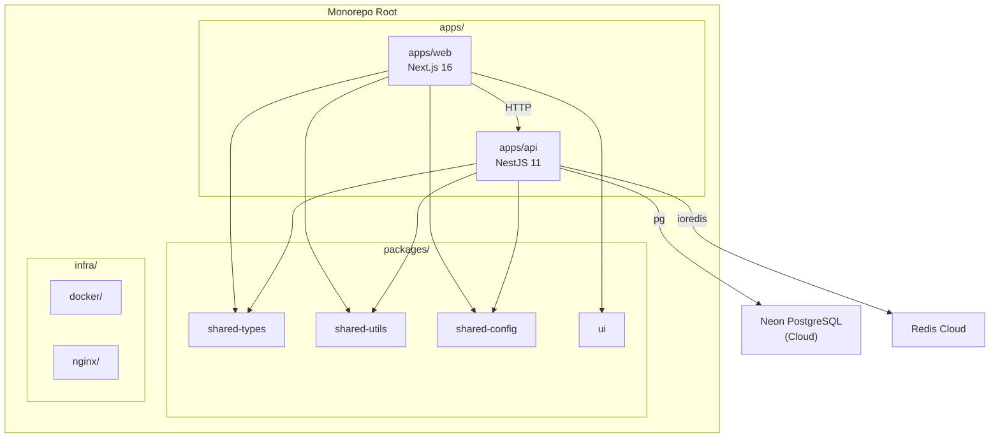

# Architecture Overview
## Monorepo Structure

## Package Dependency Graph
| Package             | Depends On                           |
| ------------------- | ------------------------------------ |
| `@p2p-share/web`    | shared-types, shared-utils, shared-config, ui |
| `@p2p-share/api`    | shared-types, shared-utils, shared-config      |
| `@p2p-share/ui`     | React (peer)                         |
| `shared-types`      | (none)                               |
| `shared-utils`      | zod                                  |
| `shared-config`     | zod                                  |
## Backend Module Architecture
```
apps/api/src/
├── main.ts                    # Bootstrap & global setup
├── app.module.ts              # Root module
├── config/                    # Environment validation
│   ├── config.module.ts
│   └── env.validation.ts
├── health/                    # Health check endpoint
│   ├── health.module.ts
│   └── health.controller.ts
├── database/                  # PostgreSQL (Neon)
│   ├── database.module.ts
│   ├── database.service.ts
│   ├── migration-runner.ts
│   ├── migrations/
│   ├── queries/
│   └── seeds/
├── redis/                     # Redis Cloud
│   ├── redis.module.ts
│   └── redis.service.ts
└── common/                    # Shared utilities
    ├── filters/
    │   └── global-exception.filter.ts
    ├── interceptors/
    │   ├── response.interceptor.ts
    │   └── logging.interceptor.ts
    └── logger/
        ├── logger.module.ts
        └── logger.service.ts
```
## Frontend Architecture
```
apps/web/src/
├── app/                       # Next.js App Router
│   ├── layout.tsx             # Root layout with providers
│   ├── page.tsx               # Landing page
│   └── globals.css            # Global styles
├── components/
│   ├── providers/             # Context providers
│   │   ├── theme-provider.tsx
│   │   └── query-provider.tsx
│   └── ui/                    # shadcn/ui components
├── stores/                    # Zustand state management
│   └── app.store.ts
├── lib/                       # Utilities
│   └── api-client.ts
├── hooks/                     # Custom React hooks
├── services/                  # API service layer
└── types/                     # Frontend types
    └── index.ts
```
## API Response Format
### Success Response
```json
{
  "success": true,
  "data": { ... }
}
```
### Error Response
```json
{
  "success": false,
  "error": {
    "message": "Description of what went wrong",
    "code": "ERROR_CODE"
  }
}
```
### Health Check Response
```json
{
  "status": "ok",
  "timestamp": "2026-06-27T12:00:00.000Z",
  "services": {
    "database": { "status": "ok", "latency": "12ms" },
    "redis": { "status": "ok", "latency": "3ms" }
  }
}
```
